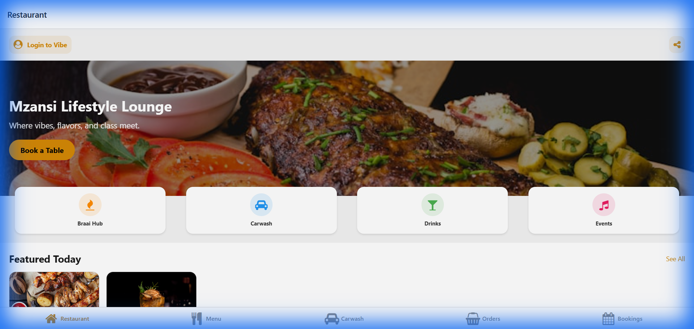

# 🥂 KIROV DYNAMICS | MZANSI LIFESTYLE LOUNGE

[](https://github.com/Raphasha27)


**Mzansi Lifestyle Lounge** is a premium **Super App** built for the ultimate South African lifestyle experience. Developed by **Kirov Dynamics Technology**, it demonstrates elite **AI Solutions & Implementation Engineering** by consolidating fine dining, event management, and luxury services into a single, cohesive digital platform.


---

## 📱 Core Features

### 🍖 Braai & Dining Hub
- **Digital Menu**: Browse high-end Braai platters, Wagyu burgers, and premium sides.
- **Smart Basket**: Real-time cart management with VAT calculation and service fees.
- **Live Order Tracking**: Watch your order status progress from `Placed` ➡️ `Preparing` ➡️ `Ready` with live visual badges.

### 🥂 Events & Vibe Access
- **Event Dashboard**: Discover upcoming DJ sets, Sunday Soul Sessions, and Braai Days.
- **RSVP System**: One-tap RSVP for exclusive parties.
- **Digital Vibe Pass**: Generates a unique **QR Code Ticket** for VIP event entry.

### 👨‍🍳 Staff Operations (KDS)
- **Kitchen Display System**: A dedicated tablet-view for kitchen staff.
- **Kanban Workflow**: Drag-and-drop style interface to move orders through prep stations.
- **Role-Based Access**: Secure "Staff Mode" login for employees.

### 🚘 Lifestyle Services
- **Premium Carwash**: Book a wash while you dine.
- **Gallery**: View the latest vibes and atmosphere.

---

## 🔐 Authentication & Roles
The app features a robust simulated authentication system:
- **User Mode**: Sign up/Login to order, book, and RSVP.
- **Staff Mode**: Special access for kitchen and management operations.

---

## 🛠️ Tech Stack

- **Framework**: [Expo SDK 50+](https://expo.dev/)
- **Language**: TypeScript
- **Navigation**: Expo Router (File-based routing)
- **State Management**: React Context API (`AuthContext`, `CartContext`, `OrderContext`, `EventContext`)
- **UI/UX**: Custom "Gold & Black" design system, Micro-animations, Glassmorphism.

---

## 🚀 Getting Started

1. **Install Dependencies**:
   ```bash
   npm install
   ```

2. **Start the App**:
   ```bash
   npx expo start
   ```

3. **Explore**:
   - **User Flow**: Login ➡️ Order Food ➡️ Track Order ➡️ RSVP to Event.
   - **Staff Flow**: Login -> Click 'Staff Access' ➡️ Open Profile Menu ➡️ Click Cutlery Icon ➡️ Manage Kitchen.

---

## 📸 Snapshots



*Built with ❤️ for the Culture.*
