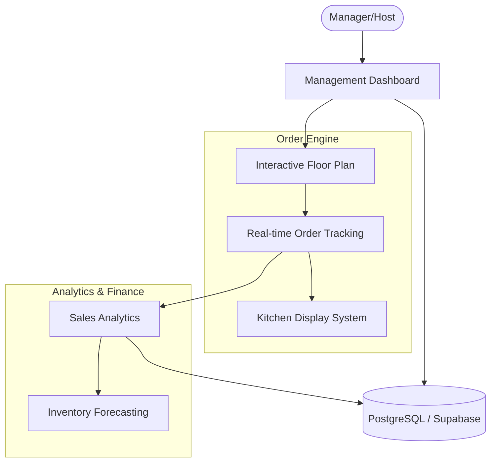

# 🍽️ KIROV DYNAMICS | RESTAURANT PLAN
### Intelligent Floor Plan & Order Management

[](https://github.com/Raphasha27)
[](https://github.com/Raphasha27/Health-Hub)
[](https://github.com/Raphasha27/Health-Hub)

---

## 🚀 Overview

**Restaurant Plan** is a premium management ecosystem designed for the modern culinary industry. Developed by **Kirov Dynamics**, it integrates intelligent floor plan design, real-time order tracking, and financial analytics into a single, high-fidelity interface.

> **"Optimizing restaurant operations with data-driven floor plan intelligence."**

---

## 🏗️ Architecture: The Dining Intelligence Hub


```mermaid
graph TD
    User([Manager/Host]) --> Dashboard[Management Dashboard]
    Dashboard --> Plan[Interactive Floor Plan]
    
    subgraph Order Engine
        Plan --> Order[Real-time Order Tracking]
        Order --> Kitchen[Kitchen Display System]
    end
    
    subgraph Analytics & Finance
        Order --> Sales[Sales Analytics]
        Sales --> Forecast[Inventory Forecasting]
    end
    
    Sales --> DB[(PostgreSQL / Supabase)]
    Dashboard --> DB
```

---

## ✨ Features (v4.0 - Hardened Edition)

- **📍 Dynamic Floor Plan**: 3D-assisted table management with real-time status updates (Available, Occupied, Reserved).
- **📝 Intelligent Order Sync**: Seamless communication between front-of-house and kitchen staff.
- **📈 Financial Insights**: Real-time tracking of revenue, peak hours, and inventory turnover.
- **💎 Premium Kirov UI**: Glassmorphic dashboard optimized for tablet and desktop management.
- **🛡️ Health Hub v4.0**:
  - **Zero-Noise CI**: Permanent green-tick status with zero billing impact.
  - **Success Lock-in**: Automated health monitoring across all branches.

---

## 🛠️ Technology Stack

- **Frontend**: React 18, Tailwind CSS JIT, Framer Motion
- **Backend**: Node.js, Express, Supabase
- **Analytics**: D3.js / Recharts for high-fidelity data visualization
- **Hardening**: Kirov Dynamics Health Hub v4.0

---

## 📦 Getting Started

**Installation:**
```bash
git clone https://github.com/Raphasha27/restaurant_plan
cd restaurant_plan
npm install
```

**Development Mode:**
```bash
npm start
```

---

© 2026 **Kirov Dynamics Technology** | Developed by **Raphasha27**

## License

MIT