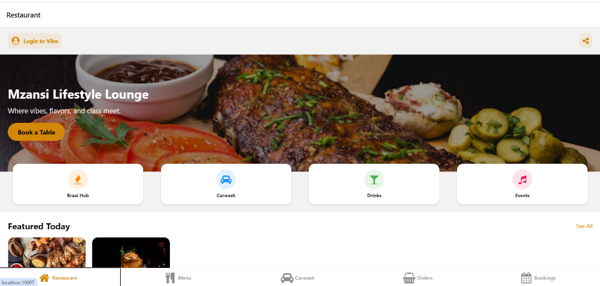
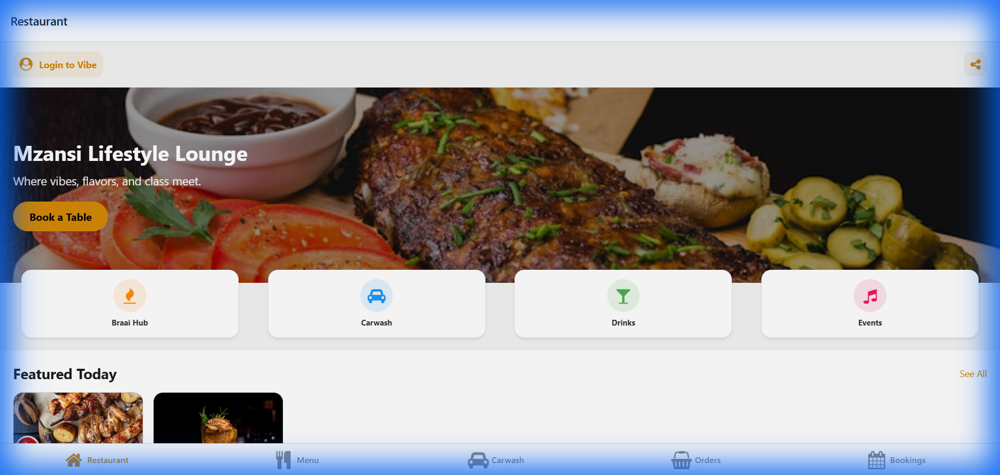

# 🇿🇦 Mzansi Lifestyle Lounge: Restaurant Development Plan

## 📌 Project Overview

The **Mzansi Lifestyle Lounge** app is a premium digital platform designed for a South African lifestyle area. It integrates a Braai Hub, Restaurant, Bar, and Carwash into a single, high-end mobile experience.

---

## 📸 User Interface
Explore the current implementation:

| **Home Screen** | **Menu Screen** |
|:---:|:---:|
|  |  |

### 🔗 **[Launch Interface (Localhost)](http://localhost:19007/)**

---

## 🌐 Other Repositories
Check out other projects in the ecosystem:

- **[Resume Generator](https://github.com/Raphasha27/resume_generator)** (`../Fire4s_Resume_Generator`)
- **[Gauteng Transport Dashboard](https://github.com/Raphasha27/dashboard)** (`../gauteng_transport_dashboard`)
- **[Management System (NexusSys)](../management_system)**
- **[Task Manager Root](../)**

---

## 🚀 Phase 1: Core Foundation (MVP) - *COMPLETED*
- [x] **Premium UI/UX Design**
    - South African themed aesthetic with Gold/Black palette.
    - *Preview:*
    - 

- [x] **Menu Management**
    - Categorized digital menu (Braai, Specialities, Drinks).
    - *Preview:*
    - 

- [x] **Smart Basket (Cart)**
    - Add items and calculate totals with service fees.

- [x] **Carwash Hub**
    - Service listings with wait-time indicators.
    - *Preview:*
    - 

- [x] **Reservations**
    - Easy table booking for groups and special occasions.
    - *Preview:*
    - 

- [x] **Responsive Layout**
    - Smooth navigation using Expo Router.

---

## 🛠️ Phase 2: User & Order Enhancement
- [ ] **User Authentication**: Secure Login/Signup (Google, Apple, Phone Number).
- [ ] **Persistent Profiles**: Save favorite meals and car details for faster carwash booking.
- [ ] **Live Order Tracking**: Move orders from "Placed" → "Preparing" → "Ready".
- [ ] **Digital Receipts**: Auto-generated PDF receipts for every transaction.

---

## 💳 Phase 3: Financial & Payments
- [ ] **Payment Gateway Integration**: Secure South African payments via **Paystack** or **Stripe**.
- [ ] **Lifestyle Wallet**: Load credits to the app for 1-tap ordering at the lounge.
- [ ] **Tipping System**: Integrated tipping for waiters and carwash staff.

---

## 📣 Phase 4: Social & Engagement
- [ ] **Event Calendar**: Integrated booking for Afro-house sets, Jazz nights, and Live DJ events.
- [ ] **Gallery Uploads**: Let users upload photos of their "Vibe" and earn points.
- [ ] **Loyalty Program**: "Braai Points" for every R100 spent, redeemable for drinks or carwash upgrades.

---

## 📈 Technical Roadmap
- **Frontend**: React Native with Expo (TypeScript).
- **Backend (Proposed)**: Firebase or Node.js/Express with PostgreSQL.
- **Notifications**: Expo Push Notifications for order readiness.
- **Analytics**: Integration with Google Analytics to track popular menu items.

---

## 📅 Target Launch Date
- **Beta Testing**: Month 2
- **Official Store Launch (App Store/Play Store)**: Month 3

---

